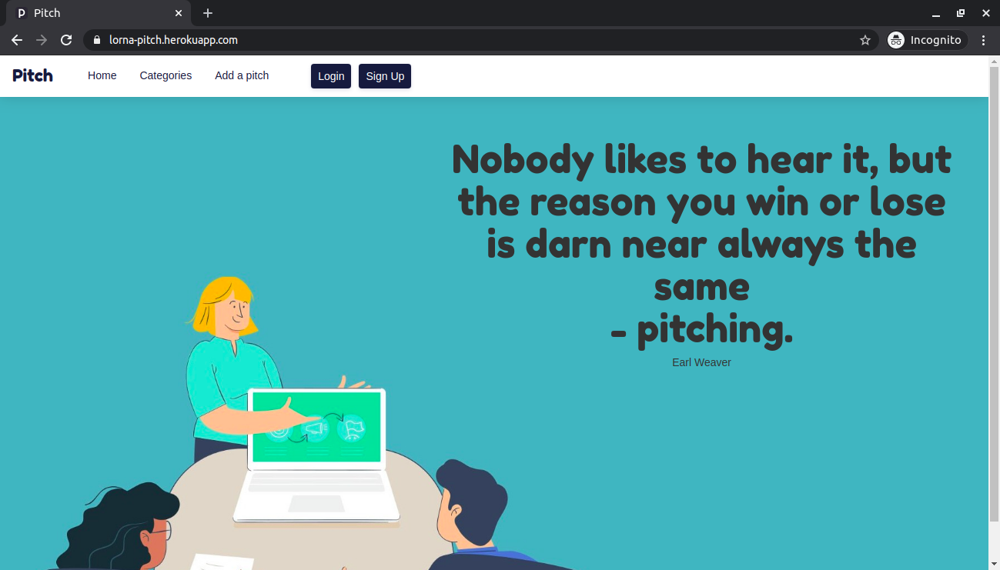

# Pitch
#### An application that allows users to post,comment and vote on pitches in various categories , 9/06/2020.
#### By Lorna Kamau

## Description
Owing to the fact that one has only 60 seconds to make an impression and consequently the impact of a good pitch, Pitch was developed. The aim is to allow users to visit the site and get inspiration on how to write the best pitch. Users can also submit their own pitches, vote and/or comment on submitted pitches.

## Live link
Visit the application on https://lorna-pitch.herokuapp.com/ .

## Development
To make advancements/modifications, follow these steps:

- Fork the repository
- Create a new branch (`git checkout -b improve-feature`)
- Make the appropriate changes in the files
- Add changes made
- Commit your changes (`git commit -am 'Improve feature'`)
- Push to the branch (`git push origin improve-feature`)
- Create a Pull Request 

## Technologies Used
Technologies used to develop this application:

1. Python v3.6
2. Flask 1.1.2
3. Flask-Bootstrap
4. HTML 
5. CSS

## Support and contact details

Should you be unable to access the website, have any recommendations and/or questions, feel free to email me:[kamaulorna@gmail.com](mailto:kamaulorna@gmail.com)

## [License](https://github.com/lornakamau/pitch/blob/master/LICENSE.md)

Copyright (c) 2020 [Lorna Kamau](https://github.com/lornakamau)  